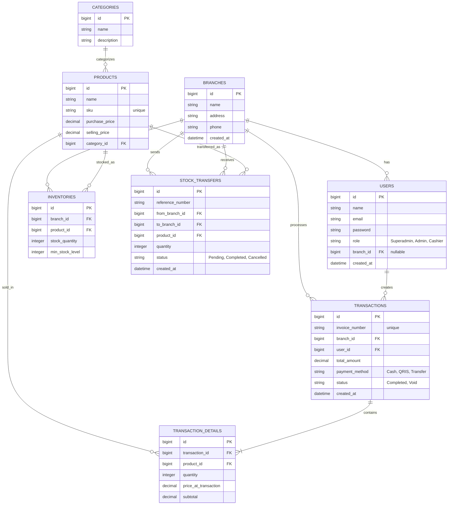

# Product Requirements Document (PRD)
**Nama Produk:** SIMPOS (Sistem Informasi Manajemen Point of Sale & Inventaris UMKM Multi-Cabang)
**Status:** Draft
**Dokumen Oleh:** Senior Product Manager & Tech Lead

---

## 1. Ringkasan Eksekutif (Executive Summary)
SIMPOS adalah platform Point of Sale (POS) dan manajemen inventaris berbasis web yang dirancang khusus untuk memenuhi kebutuhan Usaha Mikro, Kecil, dan Menengah (UMKM) yang memiliki lebih dari satu cabang. Aplikasi ini bertujuan untuk memberikan visibilitas penuh terhadap pergerakan stok, penjualan harian, dan kinerja karyawan di berbagai cabang secara real-time.

## 2. Latar Belakang & Tujuan Bisnis (Business Goals)
### Latar Belakang
Banyak UMKM yang sedang berkembang kesulitan melacak stok barang dan memonitor penjualan secara akurat ketika mereka mulai membuka cabang baru. Sistem manual sering memicu selisih stok (stock opname tidak cocok), kehilangan data penjualan, dan inefisiensi operasional.

### Tujuan Bisnis
- Mengurangi *shrinkage* (kehilangan/penyusutan barang) hingga 90% melalui pelacakan stok real-time.
- Meningkatkan efisiensi kasir dalam melayani pelanggan dengan UI/UX POS yang cepat dan responsif.
- Memberikan laporan keuangan dan penjualan yang terkonsolidasi bagi pemilik bisnis (Superadmin).

## 3. Fitur Utama (Core Features)

### 3.1 Manajemen Multi-Cabang & Pengguna (User Management)
- **Role-Based Access Control (RBAC):**
  - **Superadmin:** Akses penuh ke semua cabang, pengaturan master data, dan laporan konsolidasi.
  - **Admin/Manajer Cabang:** Mengelola inventaris dan melihat laporan khusus cabangnya saja.
  - **Kasir:** Melakukan transaksi penjualan (POS) pada cabang tempat mereka ditugaskan.
- **Manajemen Cabang:** Menambah, mengedit, atau menonaktifkan cabang.

### 3.2 Point of Sale (POS) & Transaksi
- Keranjang belanja dinamis dengan fitur pencarian barang berbasis nama atau SKU/Barcode.
- Dukungan perhitungan diskon, pajak (opsional), dan kembalian.
- Dukungan beberapa metode pembayaran (Tunai, QRIS, Transfer Bank, dll).
- Cetak struk penjualan (PDF / Thermal Printer).

### 3.3 Manajemen Inventaris (Inventory Management)
- **Katalog Produk:** Mengelola master barang (Kategori, SKU, Harga Beli, Harga Jual).
- **Stok Per Cabang:** Pemisahan pencatatan stok antar cabang.
- **Mutasi Stok (Stock Transfer):** Perpindahan barang antar cabang (dari cabang A ke cabang B) dengan status pengiriman (Pending, In Transit, Completed).
- **Peringatan Stok Tipis (Low Stock Alert):** Notifikasi otomatis ketika stok di bawah batas aman.

### 3.4 Laporan & Analitik (Reporting & Analytics)
- Dashboard informatif yang menampilkan metrik kunci (Total Penjualan, Laba Kasar, Stok Hampir Habis).
- Laporan penjualan harian/bulanan per cabang.
- Laporan pergerakan barang (Barang Masuk vs Barang Keluar).

---

## 4. Skema Data & Arsitektur (Data Schema & Architecture)

### 4.1 Penjelasan Naratif Arsitektur
Sistem ini menggunakan arsitektur monolitik dengan basis *framework* Laravel. Karena menargetkan pengguna UMKM dengan skala data menengah ke bawah, model basis data dirancang secara **relasional konvensional** yang mendukung pemisahan data tingkat baris (Row-Level Tenancy) berbasis `branch_id`.

- **Pemisahan Cabang:** Hampir setiap entitas transaksional (seperti Transaksi, Inventaris) terhubung dengan `branches`. Role Superadmin bisa melihat semua row, sementara Kasir/Manager di-*filter* berdasarkan `branch_id` mereka pada level Model (Global Scope di Laravel).
- **Katalog Produk Terpusat:** Entitas `products` dan `categories` bersifat global/terpusat. Ini memungkinkan standarisasi harga dan SKU di seluruh cabang, namun kuantitas fisik (`inventories`) dilacak secara terpisah per cabang.
- **Riwayat Transaksi:** Transaksi dipecah menjadi `transactions` (header) dan `transaction_details` (line items) untuk menormalisasi data dan mempercepat agregasi laporan.

### 4.2 Visualisasi Entity Relationship Diagram (ERD)

Berikut adalah desain skema database menggunakan visualisasi Mermaid:

---

## 5. Non-Functional Requirements (NFR)
- **Kinerja:** Waktu respon layanan POS saat memproses *checkout* dan menambah ke keranjang belanja tidak boleh lebih dari 1 detik.
- **Keamanan:** Hash password menggunakan bcrypt/Argon2. Perlindungan terhadap CSRF, XSS, dan SQL Injection (menggunakan ORM bawaan Laravel).
- **Usability:** Antarmuka harus dioptimalkan untuk akses via Desktop maupun Tablet (untuk kebutuhan *stand* kasir).
- **Skalabilitas:** Sistem mampu menampung pertumbuhan minimal hingga 50 cabang dengan puluhan ribu SKU tanpa memerlukan perombakan arsitektur database.

## 6. Rencana Pengembangan (Roadmap & Milestones)
- **Fase 1 (MVP):** Autentikasi, Master Data Barang, Master Cabang, dan POS Dasar (Penjualan Tunai/Selesai).
- **Fase 2:** Manajemen Inventaris Lanjutan (Stock Transfer, Alerts, Stock Opname).
- **Fase 3:** Modul Laporan Komprehensif dan Integrasi Payment Gateway (Opsional untuk QRIS Statis).
